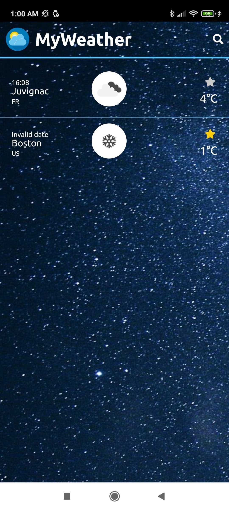

 
 
<h1>My Weather (Front : React.js / Back : Node.js)</h1>
 

Weather fullstack project based on the <a href="https://openweathermap.org/api">OpenWeatherMap API</a>. 
You can find the Backend code<a href="https://github.com/Mobu34/my-weather_backend"> here</a>.

<h3>

You can find the <a href="https://myweather-byluc.netlify.app">Live Demo here !</a>

</h3>
 
 

<h4>Design on PC :</h4>

   
   
  <h4>Design on smartphone :</h4>

 
<h2 style="color:#007db9" >Features</h2>
<ul>
  <li>Geolocation permission to show the weather of the user</li>
  
  <li>Search city and add it into favorites</li>
  
  <li>Weather details (24 next hours, 7 next days)</li>
  
  <li>Day & Night theme</li>

  <li>App responsive</li>
 
  </ul>

 
<h2 style="color:#007db9">Packages used</h2>

<ul>
  <li>react</li>
  <li>axios</li>
  <li>moment</li>
  <li>redux</li>
  <li>font-awesome</li>
<li>react-loader-spinner</li>

  </ul>

 
<h2 style="color:#007db9">Install</h2>

Just run <code>yarn</code> in your console to install all dependencies and <code>yarn start</code> to launch.

 
